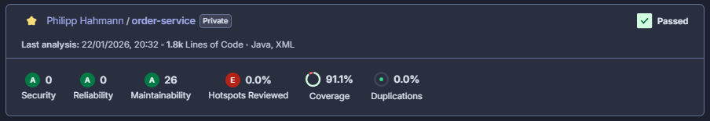

# SOAT Order Microservice (soat-ms-orders)

Microsserviço responsável pelo gerenciamento de pedidos (Order Management). Este serviço permite a criação, atualização e acompanhamento de pedidos, integrando-se com os serviços de Clientes e Produtos, além de orquestrar o fluxo de pagamento via mensageria AWS SNS/SQS.

## 📋 Sobre o Projeto

Este projeto foi desenvolvido utilizando **Java 21** e **Spring Boot 3.2**, seguindo os princípios da **Clean Architecture** para garantir o desacoplamento entre regras de negócio, interfaces e infraestrutura.

### Funcionalidades
- **Criação de Pedidos:** Recebe a solicitação, valida os itens e cria o pedido inicial.
- **Listagem de Pedidos Ativos:** Retorna os pedidos que ainda não foram finalizados, permitindo acompanhamento pela cozinha/cliente.
- **Atualização de Status:** Permite a evolução do status do pedido (ex: Recebido -> Em Preparação -> Pronto).
- **Integração Síncrona:** Comunicação via Feign Client com os microsserviços de Clientes e Produtos para validação de dados.
- **Mensageria (Pagamentos):** Publicação de eventos de pagamento pendente via AWS SNS para integração com o serviço de pagamentos.
- **Documentação:** API documentada via Swagger/OpenAPI.

## 🚀 Tecnologias Utilizadas

- **Linguagem:** Java 21
- **Framework:** Spring Boot 3.2
- **Banco de Dados:** PostgreSQL
- **Mensageria:** AWS SNS / AWS SQS (Spring Cloud AWS)
- **Documentação:** SpringDoc OpenAPI (Swagger)
- **Migrações:** Flyway
- **Qualidade de Código:** SonarQube, Jacoco
- **Infraestrutura:** Docker, Kubernetes (EKS), GitHub Actions

## 🛡️ Políticas de Branch e Segurança

Para garantir a qualidade e a estabilidade do ambiente produtivo, foram configuradas regras rígidas de proteção no repositório (**Branch Protection Rules**):

1. **Bloqueio de Commits na Main:** Não é permitido realizar commits diretamente na branch `main`. Toda alteração deve vir de uma branch auxiliar.

2. **Obrigatoriedade de Pull Requests (PR):**
   - Merges para a `main` só podem ser realizados através de Pull Requests devidamente abertos e revisados.

3. **Verificação de Status (CI):**
   - O merge do PR só é habilitado se a esteira de Integração Contínua (CI) for executada com sucesso. Isso inclui:
     - Execução e aprovação de todos os testes unitários.
     - Validação de qualidade e cobertura de código pelo SonarQube.

## ⚙️ Configuração Local

### Pré-requisitos
- Java 21 (JDK)
- Docker (para banco de dados e localstack, se necessário)
- Maven (ou utilize o wrapper `./mvnw` incluído)

### Variáveis de Ambiente
Crie as variáveis de ambiente necessárias ou defina-as no seu profile de execução (baseado em `src/main/resources/application.yml`):

```env
# Banco de Dados
DB_URL=jdbc:postgresql://localhost:5432/order
DB_USER=admin
DB_PASS=123456

# AWS (LocalStack ou Real)
AWS_REGION=us-west-2
AWS_ACCESS_KEY_ID=teste
AWS_SECRET_ACCESS_KEY=teste
AWS_SESSION_TOKEN=teste

# Integrações
CUSTOMER_SERVICE_URL=http://localhost:8000
PRODUCT_SERVICE_URL=http://localhost:8000
ORDER_PAYMENTS_TOPIC_ARN=arn:aws:sns:us-west-2:000000000000:order-payments
```

### Instalação e Execução

Utilize o Maven Wrapper para facilitar a execução sem necessidade de instalação prévia do Maven na máquina.

1. **Instalar dependências e compilar:**
   ```bash
   ./mvnw clean install
   ```

2. **Rodar a aplicação:**
   ```bash
   ./mvnw spring-boot:run
   ```
   A API estará disponível em `http://localhost:8080` (porta padrão).
   
   - **Documentação Swagger:** `http://localhost:8080/swagger-ui/index.html`
   - **Spec OpenAPI:** `http://localhost:8080/v3/api-docs`

3. **Rodar banco de dados via Docker (Opcional):**
   Caso não tenha o PostgreSQL instalado localmente, utilize o `docker-compose.yml` (se disponível) ou inicie um container:
   ```bash
   docker run --name pg-orders -e POSTGRES_PASSWORD=123456 -e POSTGRES_DB=order -p 5432:5432 -d postgres:alpine
   ```

## 🧪 Testes e Qualidade

O projeto utiliza **JUnit 5** para testes e **Jacoco** para análise de cobertura.

- **Executar todos os testes:**
   ```bash
   ./mvnw test
   ```

- **Relatório de Cobertura:**
   Após a execução dos testes, o relatório do Jacoco estará disponível em `target/site/jacoco/index.html`.

## 📊 Cobertura de Testes

Utilizamos o **SonarQube** para monitorar a qualidade do código. O pipeline exige um Quality Gate mínimo (ex: 80% de cobertura) para aprovação de PRs.

A configuração de exclusões de cobertura pode ser vista no `pom.xml` (DTOs, Mappers, Configs, etc).

Abaixo está o status atual da cobertura do projeto:



## 📦 CI/CD e Deploy

O deploy é automatizado via **GitHub Actions** (`.github/workflows/ci-cd.yml`):

1. **Build ` Test:**
   - Compilação do projeto Java.
   - Execução de testes unitários e de integração.
   
2. **Sonar Analysis:**
   - Envio das métricas e coverage para o SonarCloud.
   
3. **Build Docker Image:**
   - Criação da imagem Docker do serviço.
   - Push para o Container Registry.

4. **Deploy K8s:**
   - **Condição:** Executado na branch `main`.
   - Aplica os manifestos localizados na pasta `k8s/` (Deployments, Services, HPA, ConfigMaps).

### Recursos Kubernetes
Os manifestos de infraestrutura estão localizados na pasta `k8s/`:
- **Deployment:** Gerencia os Pods da aplicação Spring Boot.
- **Service:** Expõe a aplicação no cluster.
- **HPA:** Autoscaler horizontal baseado em CPU/Memória.
- **ConfigMaps/Secrets:** Gerenciamento de configurações e credenciais.